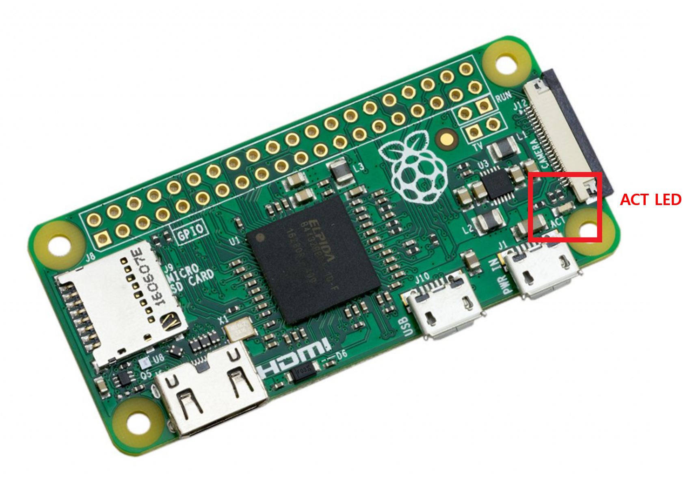
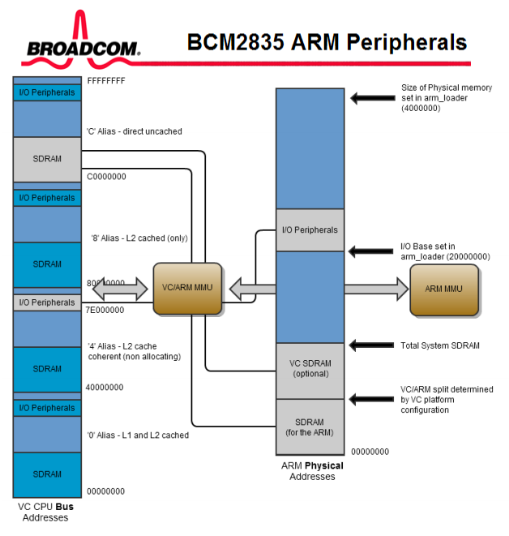
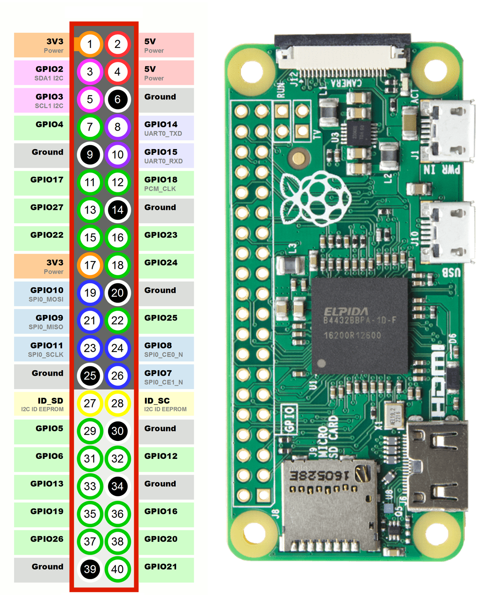
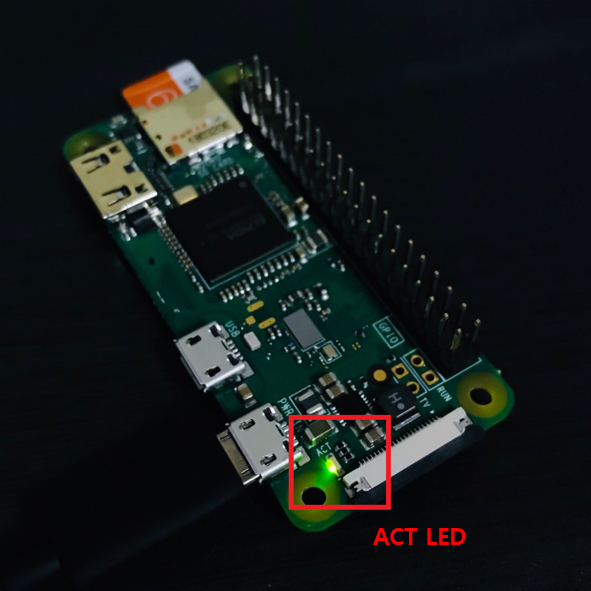

# Chapter 2: GPIO를 제어해보자! (ARM Assembly)

ARM Assembly로 Raspberry Pi Zero의 GPIO를 제어하여 ACT LED를 켜고 끄는 것을 만들어보겠습니다.  
만약 ARM Assembly를 잘 모른다면, '[ARM Assembly 기초](https://kyuhyuk.kr/article/raspberry-pi/2019/05/15/ARM-Assembly)'를 읽어보시기 바랍니다.  
  
Raspberry Pi Zero의 ACT LED는 GPIO `47`을 사용하고 있습니다.

## GPIO (General Purpose Input/Output)

모든 GPIO 핀은 소프트웨어로 입력 또는 출력 핀으로 지정 될 수 있으며 다양한 목적으로 사용됩니다.  
이번 예제에서는 GPIO 4번에 연결된 LED를 켜보겠습니다.

우선 코드를 작성하기전에 라즈베리파이의 Memory Map부터 보도록 하겠습니다.  
[`BCM2835-ARM-Peripherals.pdf`](https://github.com/LeeKyuHyuk/Raspberry-Pi-Zero-Bare-Bones/raw/master/References/documentation/BCM2835-ARM-Peripherals.pdf)의 5페이지를 보면 라즈베리파이1의 Memory Map은 아래와 같다고 설명하고 있습니다.  
  
그림을 보면 BCM2835를 사용하는 Raspberry Pi Zero의 I/O Peripherals의 물리 주소는 `0x20000000`에서 시작한다고 합니다.  
- 시스템 메모리는 ARM과 VC 파트로 분할되며, 부분적으로 공유됩니다. (예를 들면, Frame Buffer)
- ARM의 메모리 매핑 된 레지스터는 `0x20000000`부터 시작합니다.
  - BCM2835 메뉴얼에 있는 `0x7E000000` 오프셋을 `0x20000000`로 사용하면 됩니다.

Raspberry Pi Zero의 GPIO는 아래와 같습니다.  

> GPIO 핀의 번호 배정은 숫자 순서가 아닙니다.  
> GPIO 핀 `0`과 `1`은 라즈베리파이 보드의 물리적 핀 `27`과 `28`에 있지만 고급 사용을 위해 예약되어 있습니다

[`BCM2835-ARM-Peripherals.pdf`](https://github.com/LeeKyuHyuk/Raspberry-Pi-Zero-Bare-Bones/raw/master/References/documentation/BCM2835-ARM-Peripherals.pdf)의 90 페이지를 보면, GPIO는 아래와 같이 41개의 레지스터를 가지고 있습니다.

| Address | Field Name | Description | Size | Read/Write |
|---------|------------|-------------|------|------------|
| `0x 7E20 0000` | GPFSEL0 | GPIO Function Select 0 | 32 | R/W |
| `0x 7E20 0004` | GPFSEL1 | GPIO Function Select 1 | 32 | R/W |
| `0x 7E20 0008` | GPFSEL2 | GPIO Function Select 2 | 32 | R/W |
| `0x 7E20 000C` | GPFSEL3 | GPIO Function Select 3 | 32 | R/W |
| `0x 7E20 0010` | GPFSEL4 | GPIO Function Select 4 | 32 | R/W |
| `0x 7E20 0014` | GPFSEL5 | GPIO Function Select 5 | 32 | R/W |
| `0x 7E20 0018` | - | Reserved | - | - |
| `0x 7E20 001C` | GPSET0 | GPIO Pin Output Set 0 | 32 | W |
| `0x 7E20 0020` | GPSET1 | GPIO Pin Output Set 1 | 32 | W |
| `0x 7E20 0024` | - | Reserved | - | - |
| `0x 7E20 0028` | GPCLR0 | GPIO Pin Output Clear 0 | 32 | W |
| `0x 7E20 002C` | GPCLR1 | GPIO Pin Output Clear 1 | 32 | W |
| `0x 7E20 0030` | - | Reserved | - | - |
| `0x 7E20 0034` | GPLEV0 | GPIO Pin Level 0 | 32 | R |
| `0x 7E20 0038` | GPLEV1 | GPIO Pin Level 1 | 32 | R |
| `0x 7E20 003C` | - | Reserved | - | - |
| `0x 7E20 0040` | GPEDS0 | GPIO Pin Event Detect Status 0 | 32 | R/W |
| `0x 7E20 0044` | GPEDS1 | GPIO Pin Event Detect Status 1 | 32 | R/W |
| `0x 7E20 0048` | - | Reserved | - | - |
| `0x 7E20 004C` | GPREN0 | GPIO Pin Rising Edge Detect Enable 0 | 32 | R/W |
| `0x 7E20 0050` | GPREN1 | GPIO Pin Rising Edge Detect Enable 1 | 32 | R/W |
| `0x 7E20 0054` | - | Reserved | - | - |
| `0x 7E20 0058` | GPFEN0 | GPIO Pin Falling Edge Detect Enable 0 | 32 | R/W |
| `0x 7E20 005C` | GPFEN1 | GPIO Pin Falling Edge Detect Enable 1 | 32 | R/W |
| `0x 7E20 0060` | - | Reserved | - | - |
| `0x 7E20 0064` | GPHEN0 | GPIO Pin High Detect Enable 0 | 32 | R/W |
| `0x 7E20 0068` | GPHEN1 | GPIO Pin High Detect Enable 1 | 32 | R/W |
| `0x 7E20 006C` | - | Reserved | - | - |
| `0x 7E20 0070` | GPLEN0 | GPIO Pin Low Detect Enable 0 | 32 | R/W |
| `0x 7E20 0074` | GPLEN1 | GPIO Pin Low Detect Enable 1 | 32 | R/W |
| `0x 7E20 0078` | - | Reserved | - | - |
| `0x 7E20 007C` | GPAREN0 | GPIO Pin Async. Rising Edge Detect 0 | 32 | R/W |
| `0x 7E20 0080` | GPAREN1 | GPIO Pin Async. Rising Edge Detect 1 | 32 | R/W |
| `0x 7E20 0084` | - | Reserved | - | - |
| `0x 7E20 0088` | GPAFEN0 | GPIO Pin Async. Falling Edge Detect 0 | 32 | R/W |
| `0x 7E20 008C` | GPAFEN1 | GPIO Pin Async. Falling Edge Detect 1 | 32 | R/W |
| `0x 7E20 0090` | - | Reserved | - | - |
| `0x 7E20 0094` | GPPUD | GPIO Pin Pull-up/down Enable | 32 | R/W |
| `0x 7E20 0098` | GPPUDCLK0 | GPIO Pin Pull-up/down Enable Clock 0 | 32 | R/W |
| `0x 7E20 009C` | GPPUDCLK1 | GPIO Pin Pull-up/down Enable Clock 1 | 32 | R/W |
| `0x 7E20 00A0` | - | Reserved | - | - |
| `0x 7E20 00B0` | - | Test | 4 | R/W |

`GPFSEL`, `GPSET`, `GPCLR`와 같이 다양한 레지스터가 있습니다.  

우선 [[`BCM2835-ARM-Peripherals.pdf`](https://github.com/LeeKyuHyuk/Raspberry-Pi-Zero-Bare-Bones/raw/master/References/documentation/BCM2835-ARM-Peripherals.pdf)](https://github.com/LeeKyuHyuk/Raspberry-Pi-Zero-Bare-Bones/raw/master/References/documentation/BCM2835-ARM-Peripherals.pdf)의 91페이지를 보면, `GPFSEL` 레지스터는 GPIO 기능을 선택하는 레지스터라고 설명하고 있습니다.  
`GPFSEL0`은 GPIO 0번~9번을 담당하고, [`2`:`0`] 비트는 GPIO 0번, [`5`:`3`] 비트는 GPIO 1번을 담당하고 있습니다.  
3비트씩 GPIO핀을 담당하고 있으며, `000`을 지정하면 입력(Input), `001`은 출력(Output)을 설정하게 됩니다.  
GPIO 47번 핀을 출력으로 설정하려면 `GPFSEL4` 레지스터의 [`23`:`21`] 비트를 `001`로 설정하면 됩니다.

[`BCM2835-ARM-Peripherals.pdf`](https://github.com/LeeKyuHyuk/Raspberry-Pi-Zero-Bare-Bones/raw/master/References/documentation/BCM2835-ARM-Peripherals.pdf)의 95페이지를 보면 `GPSET`에 대해 설명하고 있습니다.  
`GPSET`은 GPIO 핀의 출력을 설정하는 레지스터인데, `GPSET0`과 `GPSET1`이 있습니다.
`GPSET` 레지스터의 `n`번 비트는 GPIO `n`번 핀을 정의하며, `0`을 쓰는 것은 아무 효과가 없습니다.  
`GPSET0`은 GPIO `0`번 ~ `31`번, `GPSET1`은 GPIO `32`번 ~ `53`번을 담당합니다.  
GPIO 47번 핀을 출력(Output)으로 설정했고, LED를 켜고 싶으니 `GPSET0`의 `15`번 비트를 `1`로 설정하면 됩니다.
메뉴얼을 잘 읽을줄만 알면 작업하기가 편해집니다.

**`boot.S`:**  
```assembly
.equ PERI_BASE ,0x20000000             @ Peripheral Base Address
.equ GPIO_BASE ,PERI_BASE + 0x00200000 @ GPIO Base Address

.section ".text.boot"
.globl _start

.org 0x8000                            @ 프로그램과 데이터의 시작 주소를 0x8000으로 설정

_start:
    @--------------------------------------------------
    @ ACT LED Blink
    @--------------------------------------------------
    LDR R0 ,=GPIO_BASE                 @ R0에 GPIO_BASE 주소를 넣습니다.
    MOV R1 ,#1                         @ R1에 1을 넣습니다.
    LSL R1 ,#21                        @ R1을 21번 Left Shift하여
                                       @ R1의 21번 비트를 1로 설정합니다
                                       @ 이렇게 하면, GPFSEL0의 [23:21]
                                       @ 비트를 001로 설정하게 됩니다.
    STR R1 ,[R0, #0x0010]              @ R0(0x20200000) + GPFSEL4(0x0010)에
                                       @ R1의 값을 넣습니다.

    MOV R1 ,#1                         @ R1에 1을 넣습니다.
    LSL R1 ,#15                        @ 15번 Left Shift하여 R1의 15번 비트를
                                       @ 1로 설정합니다.
    STR R1 ,[R0, #0x0020]              @ R0(0x20200000) + GPSET1(0x0020)에
                                       @ R1의 값을 넣습니다.
                                       @ GPIO 47번을 LOW로 설정하면 LED가 켜집니다.
```

**`linker.ld`:**  
```
ENTRY(_start)

SECTIONS
{
    /* Starts at LOADER_ADDR. */
    . = 0x8000;
    __start = .;
    __text_start = .;
    .text :
    {
        KEEP(*(.text.boot))
        *(.text)
    }
    . = ALIGN(4096); /* align to page size */
    __text_end = .;
    __end = .;
}
```

**`Makefile`:**  
```
SRCS = $(wildcard *.c)
OBJS = $(SRCS:.c=.o)
TARGET = arm-none-eabi
CFLAGS = -mcpu=arm1176jzf-s -fpic -ffreestanding

all: clean kernel7.img

boot.o: boot.S
	$(TARGET)-gcc $(CFLAGS) -c boot.S -o boot.o

kernel7.img: boot.o
	$(TARGET)-gcc -T linker.ld -o kernel7.elf -ffreestanding -O2 -nostdlib boot.o
	$(TARGET)-objdump -D kernel7.elf > kernel7.dump
	$(TARGET)-objcopy kernel7.elf -O binary kernel7.img

clean:
	rm kernel7.dump kernel7.elf kernel7.img *.o >/dev/null 2>/dev/null || true

minicom:
	sudo minicom -b 115200 -D /dev/ttyUSB0
```

## 작성한 코드를 빌드하여 실제 Raspberry Pi Zero에서 실행해보자!

위와 같이 `Makefile`까지 모두 작성했다면 터미널에 `make`를 입력하여 빌드합니다.  
빌드가 완료되면 `kernel7.img` 파일이 생성됩니다.

SDCard를 FAT32로 포맷합니다.  
그리고, [/References/boot](https://github.com/LeeKyuHyuk/Raspberry-Pi-Zero-Bare-Bones/tree/master/References/boot)에 있는 `bootcode.bin`, `config.txt`, `start.elf`를 모두 복사합니다.  
방금 빌드한 `kernel7.img`도 함께 복사합니다.  
  
> SDCard에 있는 `config.txt`에는 `kernel=kernel7.img`이라는 설정만 있습니다. 이 설정은 `kernel7.img`을 사용하여 부팅하겠다는 뜻입니다.

SDCard를 Raspberry Pi Zero에 넣고, 부팅하면 아래와 같이 ACT LED가 켜지는 것을 확인할 수 있습니다.  

