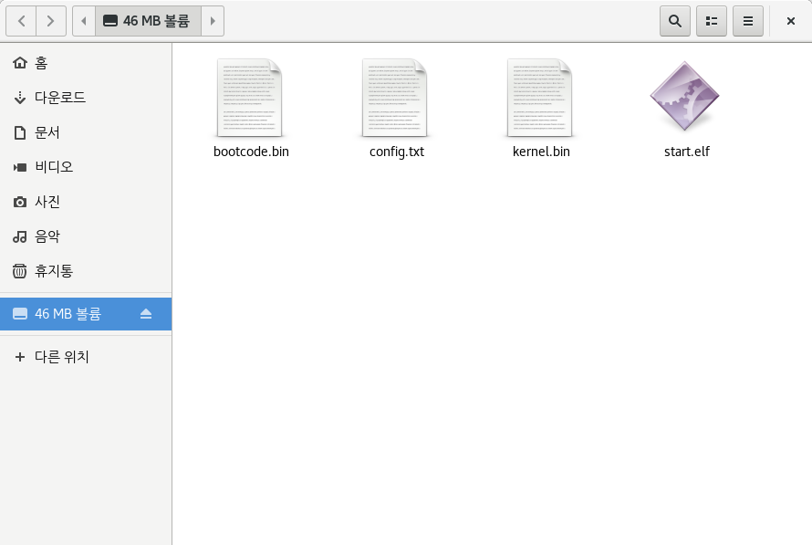
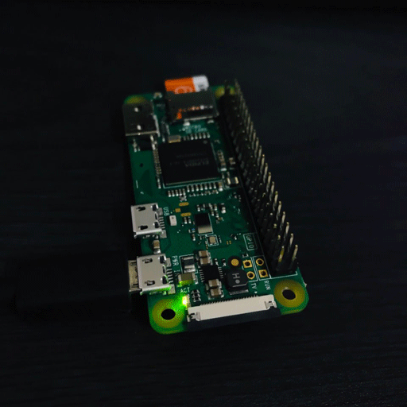

# Chapter 3: GPIO를 제어해보자! (C)

'[Chapter 2: GPIO를 제어해보자! (ARM Assembly)](https://github.com/LeeKyuHyuk/Raspberry-Pi-Zero-Bare-Bones/blob/master/Chapter-2/README.md)'에서는 ARM Assembly를 사용하여 GPIO를 제어했습니다.  
이번에는 ARM Assembly에서 C함수를 호출하여 GPIO를 제어해보도록 하겠습니다.

## Raspberry Pi Zero ACT LED Toggle

이번 장에서는 ACT LED가 계속 꺼졌다가 켜지는 것을 구현해보도록 하겠습니다.  

**`boot.S`:**  
```assembly
// 바이너리의 첫 부분에 ".text.boot"를 배치합니다.
.section ".text.boot"

// Linker에서 해당 Symbol을 찾을 수 있게 _start를 Global로 만듭니다.
.globl _start

.org 0x8000
// Kernel의 진입점(Entry point)
// r15(sp) -> 0x8000에서 실행해야 합니다.
// r0      -> 0x00000000
// r1      -> 0x00000C42
// r2      -> 0x00000100
// kernel_main에 대한 인수(Argument)로 이 레지스터들을 보존합니다.
_start:
	// Stack Pointer을 0x8000으로 설정
	mov sp, #0x8000

	// BSS를 0으로 초기화.
	ldr r4, =__bss_start
	ldr r9, =__bss_end
	mov r5, #0
	mov r6, #0
	mov r7, #0
	mov r8, #0
	b       2f

1:
	// r5~r8 레지스터에 저장된 값을 r4에 저장.
	stmia r4!, {r5-r8}

	// bss_end에 도달할 때까지 반복합니다
2:
	cmp r4, r9
	blo 1b

  // 'kernel_main' 함수 호출
	ldr r3, =kernel_main
	blx r3

	// halt
halt:
	wfe
	b halt
```

Linker Script에서 `.text.boot` 섹션을 사용하여 `boot.S`를 커널 이미지의 맨 처음에 배치합니다. 이 코드는 `kernel_main` 함수를 호출하기 전에 최소의 C 환경을 초기화합니다. 즉, 스택이 있고 BSS 세그먼트를 0으로 만드는 것을 의미합니다. 이 코드는 `r0`~`r2`를 사용하지 않으므로 `kernel_main` 호출에 유효합니다.

GPIO를 C로 제어하기 위해 우리가 사용하려고 하는 레지스터들을 `bcm2835.h`에 정의해봅시다.
**`gpio.h`:**
```c
#define MMIO_BASE       0x20000000

/* System Timer Counter registers */
#define SYSTMR_LO       (*(volatile unsigned int*)(MMIO_BASE+0x00003004))
#define SYSTMR_HI       (*(volatile unsigned int*)(MMIO_BASE+0x00003008))

/* GPIO registers */
#define GPFSEL4         (*(volatile unsigned int*)(MMIO_BASE+0x00200010))
#define GPSET1          (*(volatile unsigned int*)(MMIO_BASE+0x00200020))
#define GPCLR1          (*(volatile unsigned int*)(MMIO_BASE+0x0020002C))
```

ACT LED가 계속 꺼졌다가 켜지게 하려면 System Timer Counter를 사용해야 합니다.  
Delay 함수를 구현해봅시다.

**`delay.h`:**
```c
unsigned long get_system_timer();
void wait_msec(unsigned int n);
```

**`delay.c`:**
```c
#include "delay.h"
#include "bcm2835.h"

/**
 * Get System Timer's counter
 */
unsigned long get_system_timer() {
  unsigned int h = -1, l;
  h = SYSTMR_HI;
  l = SYSTMR_LO;
  // System Timer Counter Higher 32 bits가 변경되면, 위의 작업을 다시 합니다.
  if (h != SYSTMR_HI) {
    h = SYSTMR_HI;
    l = SYSTMR_LO;
  }
  return ((unsigned long)h << 32) | l;
}

/**
 * Wait N microseconds
 */
void wait_msec(unsigned int n) {
  unsigned long t = get_system_timer();
  // 무한 루프를 피하기 위하여 t의 값이 0이 아닌지 확인합니다.
  if (t)
    while (get_system_timer() < t + n)
      ;
}
```

준비과정은 다 끝났습니다. 이제 `kernel.c`에서 GPIO를 제어해봅시다.   
`boot.S`에서는 C와 같은 고급 언어를 사용할 수 있도록 프로세서를 설정하는 Bootstrap Assembly Stub를 작성했습니다.  
일반적인 사용자 공간에서 C 또는 C++로 프로그래밍을 하는 경우에는 호스팅 환경(Hosted Environment)을 사용했습니다. 호스팅 환경이란 C 표준 라이브러리 및 기타 기능이 있는 환경을 말합니다. 또는 독립적인(Freestanding) 환경이 있습니다. 이것은 우리가 여기서 사용하는 환경입니다. Freestanding은 C 표준 라이브러리가 없고, 우리가 제공하는 것만 사용할 수 있는 것을 의미합니다. 그러나 일부 헤더 파일은 실제로 C 표준 라이브러리의 일부가 아니라 컴파일러에서 제공하는 헤더 파일입니다. 이러한 것들은 독립적인 C 소스코드에서도 사용할 수 있습니다. 이 경우 `<stddef.h>`를 사용하여 `size_t`와 `NULL` 및 `<stdint.h>`를 가져와서 운영체제 개발에 매우 중요한 `intx_t` 및 `uintx_t` 자료형을 가져옵니다. 여기서 변수가 정확한 크기인지 확인해야 합니다. (우리가 `uint16_t` 대신 `short`를 사용하고 `short`의 크기를 변경하면, 여기에 있는 VGA 드라이버가 깨질 것입니다!) 또한 `<float.h>`, `<iso646.h>`, `<limits.h>`, `<stdarg.h>` 헤더도 사용이 가능합니다. GCC는 실제로 몇 가지 헤더를 추가로 제공하지만 이들은 특별한 목적으로 사용됩니다.  

**`kernel.c`:**  
```c
#include <stdint.h>
#include "bcm2835.h"
#include "delay.h"

void kernel_main(uint32_t r0, uint32_t r1, uint32_t atags)
{
	// r0, r1, atags를 사용하지 않는 변수로 선언
	(void) r0;
	(void) r1;
	(void) atags;
	GPFSEL4 = 1 << 21; // GPFSEL4의 21번 비트를 1로 설정합니다.
	while (1) {
		GPSET1 = 1 << 15; // GPSET1의 15번 비트를 1로 설정합니다.
		// GPIO 47번을 LOW (ACT LED ON)
		wait_msec(1000000 * 1); // 1초 Delay
		GPCLR1 = 1 << 15; // GPCLR1의 15번 비트를 1로 설정합니다.
		// GPIO 47번을 HIGH (ACT LED OFF)
		wait_msec(1000000 * 1); // 1초 Delay
	}
}
```

GPU 부트로더는 `r0`~`r2`를 통해 커널에 인수(Argument)를 전달하고 `boot.S`는 이러한 3개의 레지스터를 보존합니다. 이것들은 C 함수 호출에서 사용되는 3개의 인수입니다. `r0`은 Raspberry Pi가 부팅된 장치의 코드를 포함합니다. 일반적으로 `0`이지만 실제 값은 보드의 펌웨어에 따라 다릅니다. `r1`은 'ARM Linux Machine Type'이 들어있으며, Raspberry Pi의 경우 BCM2708 CPU를 식별하는 `3138`(`0xC42`)입니다. [여기에서](https://www.arm.linux.org.uk/developer/machines/) ARM Machine 유형의 전체 목록을 볼 수 있습니다. `r2`는 ATAG(ARM TAG)의 주소를 가지고 있습니다.

마지막으로 커널을 생성하기 위해 오브젝트 파일들을 Link 해야 합니다. 일반적인 프로그래밍을 할 때 Toolchain은 프로그램을 Link 하기 위한 기본 스크립트를 제공합니다. 하지만 커널 개발에는 적합하지 않으며 사용자 정의된 Linker Script를 사용해야 합니다. 64비트 모드의 Linker Script는 시작 주소를 제외하고는 똑같습니다.

**`linker.ld`:**  
```
ENTRY(_start)

SECTIONS
{
    /* Starts at LOADER_ADDR. */
    . = 0x8000;
    /* For AArch64, use . = 0x80000; */
    __start = .;
    __text_start = .;
    .text :
    {
        KEEP(*(.text.boot))
        *(.text)
    }
    . = ALIGN(4096); /* align to page size */
    __text_end = .;

    __rodata_start = .;
    .rodata :
    {
        *(.rodata)
    }
    . = ALIGN(4096); /* align to page size */
    __rodata_end = .;

    __data_start = .;
    .data :
    {
        *(.data)
    }
    . = ALIGN(4096); /* align to page size */
    __data_end = .;

    __bss_start = .;
    .bss :
    {
        bss = .;
        *(.bss)
    }
    . = ALIGN(4096); /* align to page size */
    __bss_end = .;
    __end = .;
}
```

`ENTRY(_start)`는 커널 이미지의 진입점을 선언합니다. 이 심볼은 `boot.S` 파일에서 선언되었습니다.

`SECTIONS`은 섹션을 선언합니다. 이것은 코드와 데이터의 비트가 어디로 갈지 결정하고 각 섹션의 크기를 추적하는데 도움이 되는 몇 가지 심볼을 설정합니다.

```assembly
    . = 0x8000;
    __start = .;
```

첫 번째 줄의 "`.`"은 현재 주소를 커널이 시작되는 `0x8000`(또는 `0x80000`)으로 설정하도록 Linker에 알리기 위해 현재 주소를 나타냅니다. Linker가 데이터를 추가하면 현재 주소가 자동으로 증가합니다. 두 번째 줄은 "`__start`" 심볼을 만들고 현재 주소로 설정합니다.

이후 섹션은 Text(Code), Read-Only Data, Read-Write Data 그리고 BSS(0으로 초기화된 메모리)로 정의됩니다.

```assembly
    __text_start = .;
    .text : {
        KEEP(*(.text.boot))
        *(.text)
    }
    . = ALIGN(4096); /* align to page size */
    __text_end = .;
```

첫 번째 행은 섹션에 `__text_start` 심볼을 만듭니다. 두 번째 줄부터 다섯 번째 줄까지는 `.text` 섹션입니다. 3행과 4행은 파일의 어떤 섹션이 `.text` 섹션에 배치될지 선언합니다. 여기서는 "`.text.boot`"이 먼저 배치되고 그 뒤에 일반적인 "`.text`"가 옵니다. "`.text.boot`"는 `boot.S`에서만 사용되며 커널 이미지의 시작 부분에서 끝납니다. "`.text`"는 나머지 코드 모두를 포함합니다. Linker에서 추가한 모든 데이터는 현재 주소("`.`")를 자동으로 증가시킵니다. 6행에서는 4096 바이트씩(Raspberry Pi에 대한 페이지 크기) 정렬되도록 설정합니다. 그리고 마지막 7행에서는 `__text_end` 심볼을 만들어서 섹션이 끝나는 곳을 알 수 있습니다.

`__text_start`와 `__text_end`는 무엇이고 페이지 정렬을 사용하는 이유는 무엇일까요? 심볼 `__text_start`와 `__text_end`는 커널 소스에서 사용될 수 있으며, Linker는 올바른 주소를 바이너리에 저장합니다. 예를 들어 `__bss_start` 와 `__bss_end`는 `boot.S`에서 사용하고 있습니다. 원한다면 C에서 `extern`으로 선언하여 사용할 수도 있습니다. 필요하진 않지만 모든 섹션을 페이지 크기에 맞게 정렬했습니다. 나중에 겹쳐서(한 페이지에 2개의 섹션) 처리할 필요 없이 Executable, Read-Only, Read-Write 권한을 사용하여 [페이지 테이블](https://ko.wikipedia.org/wiki/페이지_테이블)에 매핑할 수 있습니다.

```assembly
    __end = .;
```

모든 섹션이 선언된 후 `__end` 심볼을 만듭니다. 런타임 중에 커널의 크기를 알고 싶다면 `__start`와 `__end`를 사용하여 구할 수 있습니다.

**`Makefile`:**  
```
SRCS = $(wildcard *.c)
OBJS = $(SRCS:.c=.o)
TARGET = arm-none-eabi
CFLAGS = -mcpu=arm1176jzf-s -fpic -ffreestanding

all: clean kernel7.img

boot.o: boot.S
	$(TARGET)-gcc $(CFLAGS) -c boot.S -o boot.o

%.o: %.c
	$(TARGET)-gcc $(CFLAGS) -std=gnu99 -c $< -o $@ -O2 -Wall -Wextra

kernel7.img: boot.o $(OBJS)
	$(TARGET)-gcc -T linker.ld -o kernel7.elf -ffreestanding -O2 -nostdlib boot.o $(OBJS)
	$(TARGET)-objdump -D kernel7.elf > kernel7.dump
	$(TARGET)-objcopy kernel7.elf -O binary kernel7.img

clean:
	rm kernel7.dump kernel7.elf kernel7.img *.o >/dev/null 2>/dev/null || true

minicom:
	sudo minicom -b 115200 -D /dev/ttyUSB0
```

## 작성한 코드를 빌드하여 실제 Raspberry Pi Zero에서 실행해보자!

위와 같이 `Makefile`까지 모두 작성했다면 터미널에 `make`를 입력하여 빌드합니다.  
빌드가 완료되면 `kernel7.img` 파일이 생성됩니다.

SDCard를 FAT32로 포맷합니다.  
그리고, [/References/boot](https://github.com/LeeKyuHyuk/Raspberry-Pi-Zero-Bare-Bones/tree/master/References/boot)에 있는 `bootcode.bin`, `config.txt`, `start.elf`를 모두 복사합니다.  
방금 빌드한 `kernel7.img`도 함께 복사합니다.  
  
> SDCard에 있는 `config.txt`에는 `kernel=kernel7.img`이라는 설정만 있습니다. 이 설정은 `kernel7.img`을 사용하여 부팅하겠다는 뜻입니다.

SDCard를 Raspberry Pi Zero에 넣고, 부팅하면 아래와 같이 ACT LED가 켜지고 꺼지는 것을 확인할 수 있습니다.  

