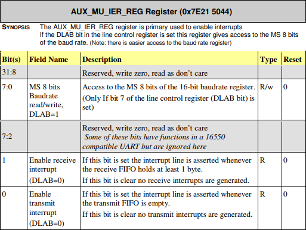

# Chapter 4: UART를 구현해보자!

> UART(범용 비동기화 송수신기: Universal asynchronous receiver/transmitter)는 병렬 데이터의 형태를 직렬 방식으로 전환하여 데이터를 전송하는 컴퓨터 하드웨어의 일종이다. UART는 일반적으로 EIA RS-232, RS-422, RS-485와 같은 통신 표준과 함께 사용한다.
> [Wikipedia - UART](https://ko.wikipedia.org/wiki/UART)

Mini UART를 사용하여 UART를 구현해보도록 하겠습니다.

## `uart_init()` : UART Initialization

1. `AUXENB` Register의 `0`번 비트(Mini UART enable)를 `1`로 설정합니다.  


2. `AUX_MU_CNTL_REG` Register의 모든 비트를 `0`으로 설정합니다. Tx, Rx가 비활성화 됩니다.    


3. `AUX_MU_LCR_REG` Register의 `0`번, `1`번 비트를 `1`으로 설정합니다.  
`0`번 비트는 8-bit mode를 사용하도록 설정되며, `1`번 비트 또한 같은 이유로 설정되어야 합니다.  
***문서에는 `5`:`1`번 비트가 Reserved라고 표기 되어있지만 이렇게 하지 않으면 정상적인 데이터가 전송되지 않습니다.***  
[BCM2835 datasheet errata #14P](https://elinux.org/BCM2835_datasheet_errata#p14)에 BCM2835 Datasheet의 `AUX_MU_LCR_REG`의 틀린 부분이 언급되어 있습니다.  


4. `AUX_MU_MCR_REG` Register의 모든 비트를 `0`으로 설정합니다.  


5. `AUX_MU_IER_REG` Register의 모든 비트를 `0`으로 설정합니다.  


6. `AUX_MU_IIR_REG` Register의 비트를 `11000001`로 설정합니다.  

  - Interrupt Pending[`0`], FIFO Enable[`7`:`6`]

7. `AUX_MU_BAUD` Register를 `270`으로 설정합니다.  

  - `baudrate = system_clock_freq / 8 * (baudrate_reg + 1)`
  - **`baudrate_reg` 계산 방법:**
    - `baudrate_reg = (system_clock_freq / 8 * baudrate) - 1`
    - `baudrate_reg = (250000000 / 8 * 115200) - 1 = 270.267‥ ≈ 270`

8. `GPFSEL1` Register에서 GPIO 14, 15 Pin을 'Alternate function 5'로 설정합니다.  
  


9. `GPPUD` Register의 [`1`:`0`]을 `0`으로 설정합니다.  

  - Off - Disable Pull-up/down

10. `GPPUDCLK0` Register에서 `14`, `15`번 비트를 `1`로 설정합니다.  
(GPIO Pin 14, 15를 Assert Clock on line으로 만듭니다)  


11. `GPPUDCLK0` Register를 `0`으로 설정하여, 모든 GPIO Pin을 No Effect로 만듭니다.

> **9번 ~ 11번 과정 설명 :**
> 1. `GPPUD`에 기록하여 필요한 control signal를 설정합니다.
> 2. control signal를 설정하기 위해 150 사이클을 기다립니다.
> 3. `GPPUD`에서 수정한 GPIO의 control signal에 clock을 보내기 위해 `GPPUDCLK0`에서도 해당 GPIO 핀을 수정합니다.
> 4. 150 사이클을 기다립니다.
> 5. '1'에서 `GPPUD`에 기록했던 GPIO의 설정을 제거합니다.
> 6. '3'에서 `GPPUDCLK0`에 기록했던 GPIO의 설정을 제거합니다.

12. `AUX_MU_CNTL_REG` Register의 `0`, `1`번 비트를 `1`로 설정하여 Tx, Rx를 활성화 합니다.  


```c
/* initialize UART */
void uart_init() {
  volatile unsigned char delay;

  AUX_ENABLES |= 1; // Mini UART 활성화
  AUX_MU_CNTL = 0;  // Tx, Rx 비활성화
  AUX_MU_LCR = 3;   // Data size : 8-bit mode
  AUX_MU_MCR = 0;
  AUX_MU_IER = 0;
  AUX_MU_IIR = 0xC1; // Interrupts 비활성화
  AUX_MU_BAUD = 270; // Baudrate를 115200로 설정

  // UART1 GPIO pins setting
  GPFSEL1 = (2 << 12) | (2 << 15); // GPIO 14, 15핀을 alternate function 5로 설정
  GPPUD = 0;                       // GPIO 14, 15핀 활성화
  for (delay = 0; delay < 150; delay++)
    asm volatile("nop");
  GPPUDCLK0 = (1 << 14) | (1 << 15);
  for (delay = 0; delay < 150; delay++)
    asm volatile("nop");
  GPPUDCLK0 = 0;   // Flush GPIO setup
  AUX_MU_CNTL = 3; // Tx, Rx 활성화
}
```

## `uart_send()` : Send a character

1. `AUX_MU_LSR_REG` Register의 `5`번째 비트인 'Transmitter Empty'를 확인합니다.


2. 'Transmitter Empty'가 `1`이면 `AUX_MU_IO_REG`에 Data를 넣어 Buffer에 문자를 기록합니다.  


```c
/* Send a character */
void uart_send(unsigned int data) {
  // AUX_MU_LSR의 Transmitter Empty 비트가 '1'이 될 때까지 대기합니다.
  do {
    asm volatile("nop");
  } while (!(AUX_MU_LSR & (1<<5)));
  // Buffer에 문자를 기록합니다.
  AUX_MU_IO = data;
}
```

## `uart_getc()` : Receive a character

1. `AUX_MU_LSR_REG` Register의 `1`번째 비트인 'Data ready'를 확인합니다.


2. 'Data ready'가 `1`이면 `AUX_MU_IO_REG`의 Data를 읽어 반환합니다.  


```c
/*  Receive a character */
char uart_getc() {
  char character;
  // Buffer에 무엇인가 있을때까지 대기합니다.
  do {
    asm volatile("nop");
  } while (!(AUX_MU_LSR & 1));
  // AUX_MU_IO에서 값을 읽어오고 return 합니다.
  character = (char)(AUX_MU_IO);
  // '\r'를 '\n'으로 변환합니다.
  return character == '\r' ? '\n' : character;
}
```

## `uart_puts()` : Display a string

앞에서 만들었던 `uart_send()`를 사용하여, `string`의 index를 1씩 더하며 `string`이 `NULL`이 될 때까지 `uart_send(*string++);`을 호출합니다.

```c
/* Display a string */
void uart_puts(char *string) {
  while (*string) {
    // '\n'를 '\r'으로 변환합니다.
    if (*string == '\n')
      uart_send('\r');
    uart_send(*string++);
  }
}
```

## Source Code

**boot.S :**

```
// 바이너리의 첫 부분에 ".text.boot"를 배치합니다.
.section ".text.boot"

// Linker에서 해당 Symbol을 찾을 수 있게 _start를 Global로 만듭니다.
.globl _start

.org 0x8000
// Kernel의 진입점(Entry point)
// r15(sp) -> 0x8000에서 실행해야 합니다.
// r0      -> 0x00000000
// r1      -> 0x00000C42
// r2      -> 0x00000100
// kernel_main에 대한 인수(Argument)로 이 레지스터들을 보존합니다.
_start:
	// Stack Pointer을 0x8000으로 설정
	mov sp, #0x8000

	// BSS를 0으로 초기화.
	ldr r4, =__bss_start
	ldr r9, =__bss_end
	mov r5, #0
	mov r6, #0
	mov r7, #0
	mov r8, #0
	b       2f

1:
	// r5~r8 레지스터에 저장된 값을 r4에 저장.
	stmia r4!, {r5-r8}

	// bss_end에 도달할 때까지 반복합니다
2:
	cmp r4, r9
	blo 1b

	// 'kernel_main' 함수 호출
	ldr r3, =kernel_main
	blx r3

	// halt
halt:
	wfe
	b halt

```

**bcm2835.h :**

```c
#define MMIO_BASE       0x20000000

/* GPIO registers */
#define GPFSEL1         (*(volatile unsigned int*)(MMIO_BASE+0x00200004))
#define GPPUD           (*(volatile unsigned int*)(MMIO_BASE+0x00200094))
#define GPPUDCLK0       (*(volatile unsigned int*)(MMIO_BASE+0x00200098))

/* Auxilary mini UART registers */
#define AUX_ENABLES     (*(volatile unsigned int*)(MMIO_BASE+0x00215004))
#define AUX_MU_IO       (*(volatile unsigned int*)(MMIO_BASE+0x00215040))
#define AUX_MU_IER      (*(volatile unsigned int*)(MMIO_BASE+0x00215044))
#define AUX_MU_IIR      (*(volatile unsigned int*)(MMIO_BASE+0x00215048))
#define AUX_MU_LCR      (*(volatile unsigned int*)(MMIO_BASE+0x0021504C))
#define AUX_MU_MCR      (*(volatile unsigned int*)(MMIO_BASE+0x00215050))
#define AUX_MU_LSR      (*(volatile unsigned int*)(MMIO_BASE+0x00215054))
#define AUX_MU_CNTL     (*(volatile unsigned int*)(MMIO_BASE+0x00215060))
#define AUX_MU_BAUD     (*(volatile unsigned int*)(MMIO_BASE+0x00215068))
```

**uart.h :**

```c
void uart_init();
void uart_send(unsigned int c);
char uart_getc();
void uart_puts(char *s);
```

**uart.c :**

```c
#include "bcm2835.h"
#include "uart.h"

/**
 * initialize UART
 */
void uart_init() {
        volatile unsigned char delay;

        AUX_ENABLES |= 1; // Mini UART 활성화
        AUX_MU_CNTL = 0; // Tx, Rx 비활성화
        AUX_MU_LCR = 3; // Data size : 8-bit mode
        AUX_MU_MCR = 0;
        AUX_MU_IER = 0;
        AUX_MU_IIR = 0xC1; // Interrupts 비활성화
        AUX_MU_BAUD = 270; // Baudrate를 115200로 설정

        // UART1 GPIO pins setting
        GPFSEL1 = (2 << 12) | (2 << 15); // GPIO 14, 15핀을 alternate function 5로 설정
        GPPUD = 0;           // GPIO 14, 15핀 활성화
        for (delay = 0; delay < 150; delay++)
                asm volatile ("nop");
        GPPUDCLK0 = (1 << 14) | (1 << 15);
        for (delay = 0; delay < 150; delay++)
                asm volatile ("nop");
        GPPUDCLK0 = 0; // Flush GPIO setup
        AUX_MU_CNTL = 3; // Tx, Rx 활성화
}

/**
 * Send a character
 */
void uart_send(unsigned int data) {
        // AUX_MU_LSR의 Transmitter Empty 비트가 '1'이 될 때까지 대기합니다.
        do {
                asm volatile ("nop");
        } while (!(AUX_MU_LSR & (1 << 5)));
        // Buffer에 문자를 기록합니다.
        AUX_MU_IO = data;
}

/**
 * Receive a character
 */
char uart_getc() {
        char character;
        // Buffer에 무엇인가 있을때까지 대기합니다.
        do {
                asm volatile ("nop");
        } while (!(AUX_MU_LSR & 1));
        // AUX_MU_IO에서 값을 읽어오고 return 합니다.
        character = (char)(AUX_MU_IO);
        // '\r'를 '\n'으로 변환합니다.
        return character == '\r' ? '\n' : character;
        ;
}

/**
 * Display a string
 */
void uart_puts(char *string) {
        while (*string) {
                // '\n'를 '\r'으로 변환합니다.
                if (*string == '\n')
                        uart_send('\r');
                uart_send(*string++);
        }
}
```

**kernel.c :**

```c
#include <stdint.h>
#include "bcm2835.h"
#include "uart.h"

void kernel_main(uint32_t r0, uint32_t r1, uint32_t atags)
{
	// r0, r1, atags를 사용하지 않는 변수로 선언
        (void) r0;
        (void) r1;
        (void) atags;

        // UART 초기화
        uart_init();

        // "Hello World!"를 UART로 출력
        uart_puts("Hello World!\n");
        uart_puts("Raspberry Pi Zero UART\n");

        // UART 입력되는 것을 UART로 출력 (Echo 기능)
        while (1) {
                uart_send(uart_getc());
        }
}
```


**Makefile :**

```
SRCS = $(wildcard *.c)
OBJS = $(SRCS:.c=.o)
TARGET = arm-none-eabi
CFLAGS = -mcpu=arm1176jzf-s -fpic -ffreestanding

all: clean kernel7.img

boot.o: boot.S
	$(TARGET)-gcc $(CFLAGS) -c boot.S -o boot.o

%.o: %.c
	$(TARGET)-gcc $(CFLAGS) -std=gnu99 -c $< -o $@ -O2 -Wall -Wextra

kernel7.img: boot.o $(OBJS)
	$(TARGET)-gcc -T linker.ld -o kernel7.elf -ffreestanding -O2 -nostdlib boot.o $(OBJS)
	$(TARGET)-objcopy kernel7.elf -O binary kernel7.img

clean:
	rm kernel7.elf kernel7.img *.o >/dev/null 2>/dev/null || true

minicom:
	sudo minicom -b 115200 -D /dev/ttyUSB0
```

**linker.ld :**

```
ENTRY(_start)

SECTIONS
{
    /* Starts at LOADER_ADDR. */
    . = 0x8000;
    /* For AArch64, use . = 0x80000; */
    __start = .;
    __text_start = .;
    .text :
    {
        KEEP(*(.text.boot))
        *(.text)
    }
    . = ALIGN(4096); /* align to page size */
    __text_end = .;

    __rodata_start = .;
    .rodata :
    {
        *(.rodata)
    }
    . = ALIGN(4096); /* align to page size */
    __rodata_end = .;

    __data_start = .;
    .data :
    {
        *(.data)
    }
    . = ALIGN(4096); /* align to page size */
    __data_end = .;

    __bss_start = .;
    .bss :
    {
        bss = .;
        *(.bss)
    }
    . = ALIGN(4096); /* align to page size */
    __bss_end = .;
    __end = .;
}
```

## 작성한 코드를 빌드하여 실제 Raspberry Pi Zero에서 실행해보자!

putty나 minicom을 사용하여 UART 통신을 해봅니다. 이 예제에서는 `make minicom`을 하면 minicom을 사용하여 UART 통신을 할 수 있습니다.

**[PUTTY]**


**[MINICOM]**


만약, minicom에서 키보드 입력이 되지 않는다면 `minicom -s`로 설정에 들어가서 'Hardware Flow Control'을 NO로 설정합니다.  

