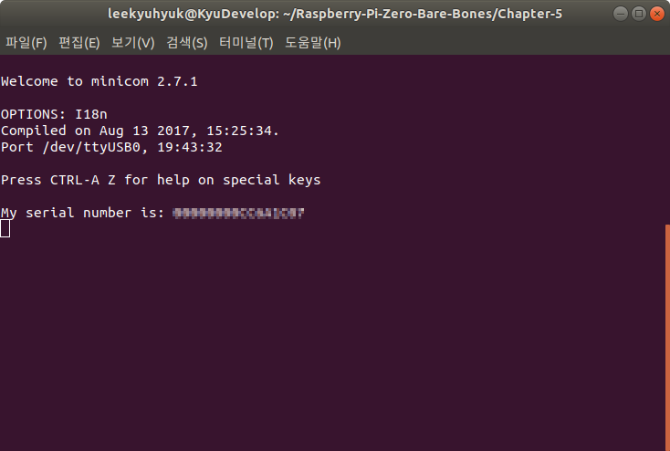

# Chapter 5: Mailboxes Interface를 사용하여 Serial Number를 출력해보자!

Mailbox는 GPU에서 실행되는 Firmware와 ARM이 서로 통신하는 수단입니다. 사용 가능한 Mailbox 목록을 보려면 [여기](https://github.com/raspberrypi/firmware/wiki/Mailboxes)를 참고하세요.

Serial Number를 가져오려면, [Mailbox property interface](https://github.com/raspberrypi/firmware/wiki/Mailbox-property-interface#get-board-serial)를 보면 Tag `0x00010004`(Get board serial)를 Mailbox에 보내면 됩니다. Response로 나오는 반환 값은 `uint64_t`로 나오는데 이것을 16진수 값으로 변환하려면 `uart_hex()`를 구현해야 합니다.

## `uart_hex()` : Display a DWORD(4Byte) value in hexadecimal

```c
/**
 * Display a DWORD(4Byte) value in hexadecimal
 */
void uart_hex(unsigned int value) {
        unsigned int number=0;
        int shiftCount;

        for(shiftCount=28; shiftCount>=0; shiftCount=shiftCount-4) {
                number=(value>>shiftCount)&0xF;
                // 0-9 => '0'-'9', 10-15 => 'A'-'F'
                if (number>=10)
                        number = number + 0x37;
                else
                        number = number + 0x30;
                uart_send(number);
        }
}
```

1) 인수로 `unsiged int`의 `value`를 받습니다. 만약 `0xD`를 `value`로 받는다면 `0x0000000D`가 `value`에 저장됩니다.  
2) `value`를 28번 Right Shift한 뒤, `0xF`와 AND 비트연산을 하고 그 값을 `number`에 저장합니다.  
3) `number`가 `10`보다 크거나 같다면, '`A`'~'`F`'로 변환합니다. `number`에 `0x37`를 더합니다. 만약 10보다 작다면 `number`에 `0x30`을 더합니다.

**< ASCII Table >**

| Dec | Hex | Char | Raw encoding |
|-----|-----|------|--------------|
| 48 | `0030` | 0 | `0x30` |
| 49 | `0031` | 1 | `0x31` |
| 50 | `0032` | 2 | `0x32` |
| 51 | `0033` | 3 | `0x33` |
| 52 | `0034` | 4 | `0x34` |
| 53 | `0035` | 5 | `0x35` |
| 54 | `0036` | 6 | `0x36` |
| 55 | `0037` | 7 | `0x37` |
| 56 | `0038` | 8 | `0x38` |
| 57 | `0039` | 9 | `0x39` |
| 58 | `003a` | : | `0x3A` |
| 59 | `003b` | ; | `0x3B` |
| 60 | `003c` | < | `0x3C` |
| 61 | `003d` | = | `0x3D` |
| 62 | `003e` | > | `0x3E` |
| 63 | `003f` | ? | `0x3F` |
| 64 | `0040` | @ | `0x40` |
| 65 | `0041` | A | `0x41` |
| 66 | `0042` | B | `0x42` |
| 67 | `0043` | C | `0x43` |
| 68 | `0044` | D | `0x44` |
| 69 | `0045` | D | `0x45` |
| 70 | `0046` | F | `0x46` |

만약 `number`가 `13`이라면, 위의 ASCII Table에서 `0x37`에서 아래로 13번 내려가면 Char가 'D'입니다. 이는 13의 16진수인 D와 같습니다.
이 값을 `uart_send()`를 사용하여 출력되게 하면 됩니다.

## Mailbox Interface

Mailbox Register를 `bcm2835.h`에 추가합니다. [Mailbox registers](https://github.com/raspberrypi/firmware/wiki/Mailboxes#mailbox-registers)를 참고하였습니다.

```c
/* Mailbox registers */
#define MAILBOX_BASE	     (MMIO_BASE+0x0000B880) // Mailbox Base Address
#define MAILBOX_READ       (*(volatile unsigned int*)(MAILBOX_BASE+0x0)) // Mailbox Read Register
#define MAILBOX_POLL       (*(volatile unsigned int*)(MAILBOX_BASE+0x10)) // Mailbox Poll Register
#define MAILBOX_SENDER     (*(volatile unsigned int*)(MAILBOX_BASE+0x14)) // Mailbox Sender Register
#define MAILBOX_STATUS     (*(volatile unsigned int*)(MAILBOX_BASE+0x18)) // Mailbox Status Register
#define MAILBOX_CONFIG     (*(volatile unsigned int*)(MAILBOX_BASE+0x1C)) // Mailbox Config Register
#define MAILBOX_WRITE      (*(volatile unsigned int*)(MAILBOX_BASE+0x20)) // Mailbox Write Register
```

`mailbox.h`에 [Channel](https://github.com/raspberrypi/firmware/wiki/Mailboxes#channels)과 [Tag](https://github.com/raspberrypi/firmware/wiki/Mailbox-property-interface#tags-arm-to-vc)를 정의합니다.

```c
/* Mailbox Buffer */
extern volatile unsigned int mailbox[36];

#define MAILBOX_REQUEST    0

/* Channels */
#define MAILBOX_CH_POWER   0 // Power Management Interface
#define MAILBOX_CH_FB      1 // Frame Buffer
#define MAILBOX_CH_VUART   2 // Virtual UART
#define MAILBOX_CH_VCHIQ   3 // VCHIQ Interface
#define MAILBOX_CH_LEDS    4 // LEDs Interface
#define MAILBOX_CH_BTNS    5 // Buttons Interface
#define MAILBOX_CH_TOUCH   6 // Touchscreen Interface
#define MAILBOX_CH_COUNT   7 // Counter
#define MAILBOX_CH_PROP    8 // Tags (ARM to VC)

/* Tags */
#define MAILBOX_TAG_GETSERIAL      0x00010004
#define MAILBOX_TAG_LAST           0

int mailbox_call(unsigned char ch);
```

### General procedure

- Mailbox에서 Read 할 때 :
  1. Empty flag가 설정되지 않을 때까지 Mailbox Status Register를 읽습니다.
  2. Mailbox Read Register에서 데이터를 읽어옵니다.
  3. 하위 4비트가 원하는 채널 번호와 일치하지 않으면 ①에서 다시 반복합니다.
  4. 상위 28 비트는 반환된 데이터입니다.
- Mailbox에 Write 할 때 :
  1. Full flag가 설정되지 않을 때까지 Mailbox Status Register를 읽습니다.
  2. 채널(하위 4비트)과 데이터(상위 28비트)가 합쳐진 것을 Mailbox Write Register에 기록합니다.

```c
#include "bcm2835.h"

/* Mailbox Empty (Mailbox에서 읽을 내용이 없을 때) */
#define MAILBOX_EMPTY      0x40000000
/* Mailbox Full (Mailbox에 쓸 공간이 없을 때) */
#define MAILBOX_FULL       0x80000000
#define MAILBOX_RESPONSE   0x80000000

/* Mailbox Message Buffer */
volatile unsigned int __attribute__((aligned(16))) mailbox[36];

/**
 * Mailbox를 호출 합니다.
 * 반환값이 0이면 실패이고, 0이 아닌 숫자이면 성공입니다.
 */
int mailbox_call(unsigned char ch)
{
        unsigned int r = (((unsigned int)((unsigned long)&mailbox)&~0xF) | (ch&0xF));
        // Mailbox에 쓸 수 있을때 까지 기다립니다.
        // Full flag가 설정되지 않을 때 까지 Mailbox Status Register를 읽습니다.
        do {
                asm volatile ("nop");
        } while(MAILBOX_STATUS & MAILBOX_FULL);
        // mailbox 변수의 채널 부분을 주소를 Mailbox의 채널 식별자에 씁니다.
        MAILBOX_WRITE = r;
        // Response를 기다립니다.
        while(1) {
                // Response가 올때까지 nop합니다.
                do {
                        asm volatile ("nop");
                } while(MAILBOX_STATUS & MAILBOX_EMPTY);
                // 요청한 Response인지 확인합니다.
                if(r == MAILBOX_READ)
                        // 유효한 Response인지 확인합니다.
                        return mailbox[1]==MAILBOX_RESPONSE;
        }
        return 0;
}
```

`kernel.c`에서 보드의 고유한 Serial Number를 Mailbox 호출을 통하여 출력합니다.

```c
#include <stdint.h>
#include "bcm2835.h"
#include "uart.h"
#include "mailbox.h"

void kernel_main(uint32_t r0, uint32_t r1, uint32_t atags)
{
        // r0, r1, atags를 사용하지 않는 변수로 선언
        (void) r0;
        (void) r1;
        (void) atags;

        // UART 초기화
        uart_init();

        // 보드의 고유한 Serial Number를 Mailbox 호출로 얻습니다.
        mailbox[0] = 8*4;                   // Message의 길이
        mailbox[1] = MAILBOX_REQUEST;       // Request message임을 표기합니다.
        mailbox[2] = MAILBOX_TAG_GETSERIAL; // Get Serial Number Command
        mailbox[3] = 8;                     // Buffer Size
        mailbox[4] = 8;
        mailbox[5] = 0;                     // Output buffer를 초기화 합니다.
        mailbox[6] = 0;
        mailbox[7] = MAILBOX_TAG_LAST;

        // Message를 GPU로 보내고, 응답을 받습니다.
        if (mailbox_call(MAILBOX_CH_PROP)) {
                uart_puts("My serial number is: ");
                uart_hex(mailbox[6]);
                uart_hex(mailbox[5]);
                uart_puts("\n");
        } else {
                uart_puts("Unable to query serial!\n");
        }

        // UART 입력되는 것을 UART로 출력 (Echo 기능)
        while (1) {
                uart_send(uart_getc());
        }
}
```

## 작성한 코드를 빌드하여 실제 Raspberry Pi Zero에서 실행해보자!


